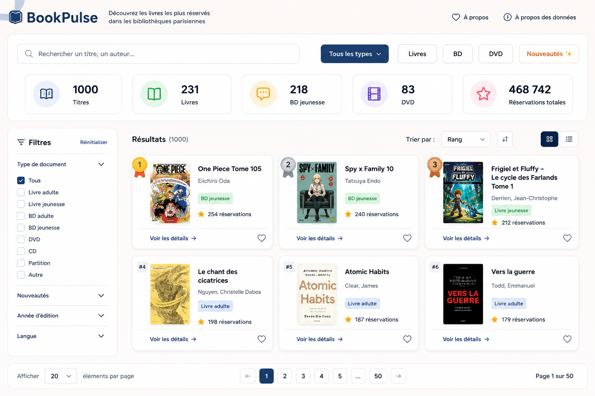
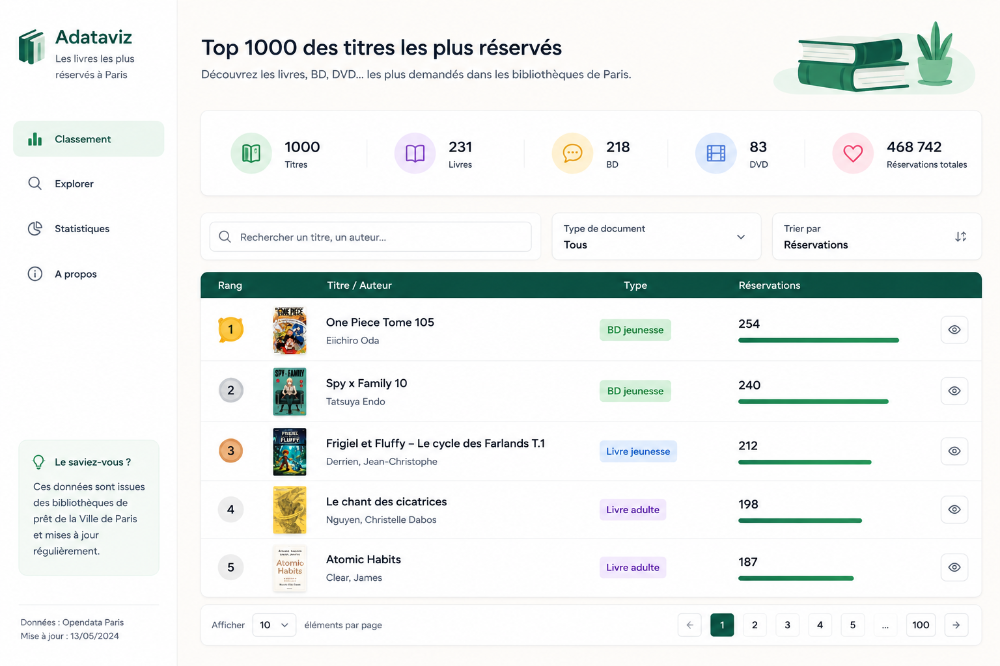

https://opendata.paris.fr/explore/dataset/les-1000-titres-les-plus-reserves-dans-les-bibliotheques-de-pret/information/

---------------------------------------------------
📚 BookPulse

Découvrez les livres les plus demandés
dans les bibliothèques parisiennes

[ 🔍 Rechercher un titre ou un auteur ]

[Tous ▼] [Livres] [BD] [DVD] [Nouveautés]

---------------------------------------------------

🏆 Top résultats

┌─────────────────────────────────────────────┐
│ #1                                           │
│ 📖 One Piece Tome 105                        │
│ ✍ Eiichiro Oda                              │
│                                              │
│ 📚 Bande dessinée jeunesse                  │
│ ⭐ 254 réservations                         │
└─────────────────────────────────────────────┘

┌─────────────────────────────────────────────┐
│ #2                                           │
│ 📖 Spy x Family 10                           │
│ ✍ Tatsuya Endo                             │
│                                              │
│ 📚 Manga                                    │
│ ⭐ 240 réservations                         │
└─────────────────────────────────────────────┘

---------------------------------------------------
Les cartes
Chaque carte contient :

📖 Nom du livre

✍ Auteur

📚 Type de document

🏆 Rang

⭐ Nombre de réservations

---------------------------------------------------

